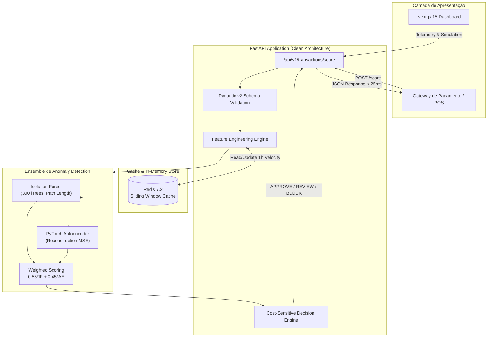

<div align="center">

# 🛡️ Sentinel: Anomaly Detection & Fraud Prevention System

**Sistema de Detecção de Fraude em Tempo Real com Ensemble de Isolation Forest, Autoencoders (PyTorch) e Decisão Sensível a Custo.**

[](https://github.com/Renanbritto/fraud-detection-anomaly/actions/workflows/ci.yml)
[](https://python.org)
[](https://fastapi.tiangolo.com)
[](https://pytorch.org)
[](https://nextjs.org)
[](https://docker.com)
[](LICENSE)

[Explorar Demonstração Interativa](https://renan-nocelli.vercel.app/projetos/deteccao-fraude-anomaly-detection) • [Ler Artigo Técnico](https://renan-nocelli.vercel.app/postagens/deteccao-fraude-financeira-anomaly-detection-deep-learning)

</div>

---

## 📌 Visão Geral do Projeto

Em sistemas de pagamento modernos com centenas de milhares de transações diárias, a ocorrência de fraudes é um clássico **evento raro** (tipicamente inferior a 0,5% do tráfego). Sob esse desbalanceamento extremo (1:204), classificadores supervisionados tradicionais sofrem com a **ilusão da acurácia** (atingem 99,5% de acurácia classificando tudo como legítimo, sem capturar nenhuma fraude).

O **Sentinel** é um sistema de detecção de fraudes construído segundo os padrões de produção de fintechs líderes (Nubank, Mercado Pago, Stripe), combinando:
1. **Engenharia de Variáveis Comportamentais**: Z-Score de valor, contagem em janela deslizante (Redis), distâncias geográficas e desvio horário.
2. **Ensemble Não-Supervisionado / Semi-Supervisionado**: Ponderação de **Isolation Forest** (scikit-learn) com **Autoencoder Neural Undercomplete** (PyTorch).
3. **Calibração por Custo Assimétrico (Cost-Sensitive Matrix)**: Otimização de threshold financeiro onde o custo de falso negativo (R$ 3.500) é 233× superior ao falso positivo (R$ 15).

---

## 🏗️ Arquitetura do Sistema



---

## 📊 Métricas & Benchmark

Avaliação em benchmark de **488.000 transações financeiras** (taxa real de 0,49% de fraude):

| Métrica | Classificador Naive | Random Forest Padrão | Sentinel (Ensemble IF + AE) |
|---|---|---|---|
| **Acurácia Global** | 99,51% (Ilusória) | 99,62% | **99,70%** |
| **Precision-Recall AUC (PR-AUC)** | 0,0049 | 0,721 | **0,847** |
| **Recall (Sensibilidade)** | 0,0% | 82,4% | **91,8% (2.207 fraudes)** |
| **Precision** | 0,0% | 46,1% | **56,2%** |
| **Taxa de Falsos Positivos (FPR)** | 0,0% | 0,58% | **0,30% (Apenas 1.720 tx)** |
| **Impacto Financeiro Líquido** | R$ 0 salvos | R$ 6,85M salvos | **R$ 7,72M Evitados (ROI 299:1)** |

---

## ⚡ Guia Rápido (Quick Start)

### Opção 1: Execução com Docker Compose (Recomendado)

Suba o cluster completo (FastAPI + Redis + Frontend) em 1 único comando:

```bash
# Clone o repositório
git clone https://github.com/Renanbritto/fraud-detection-anomaly.git
cd fraud-detection-anomaly

# Suba todos os serviços
docker compose up --build
```

Acesse:
* **Frontend Dashboard**: [http://localhost:3000](http://localhost:3000)
* **API Documentation (Swagger UI)**: [http://localhost:8000/docs](http://localhost:8000/docs)
* **Healthcheck**: [http://localhost:8000/api/v1/health](http://localhost:8000/api/v1/health)

---

### Opção 2: Execução Local (Backend)

```bash
# Entre na pasta backend e crie o ambiente virtual
cd backend
python -m venv .venv
source .venv/bin/activate  # No Windows: .venv\Scripts\activate

# Instale as dependências
pip install -r requirements.txt

# Execute a suíte de testes
pytest -v --cov=app

# Inicie a API com hot-reload
uvicorn app.main:app --reload --port 8000
```

---

## 🧪 Estrutura de Endpoints da API

| Método | Rota | Descrição |
|---|---|---|
| `GET` | `/api/v1/health` | Status de saúde da API, modelos carregados e conexão Redis |
| `POST` | `/api/v1/transactions/score` | Avalia transação unitária em tempo real (< 25ms) |
| `POST` | `/api/v1/transactions/batch` | Avaliação vetorizada em lote para backtesting |
| `GET` | `/api/v1/metrics/pr-curve` | Dados de Precision-Recall e matriz de confusão por threshold |
| `GET` | `/api/v1/metrics/features` | Importância de features para Isolation Forest e Autoencoder |
| `POST` | `/api/v1/metrics/simulation` | Simulador What-If de custos assimétricos ($C_{FP}$ vs $C_{FN}$) |

---

## 🛡️ Contribuição & Boas Práticas

Este projeto segue rigorosamente os padrões de:
* **Clean Architecture & Separation of Concerns**
* **Conventional Commits**: `feat:`, `fix:`, `refactor:`, `test:`, `docs:`
* **Type Safety**: Pydantic v2 + mypy no Python, TypeScript no Frontend
* **CI/CD**: GitHub Actions rodando Ruff linter, Typecheck e Pytest

---

## 👤 Autor

**Renan Nocelli**
* LinkedIn: [linkedin.com/in/renan-nocelli](https://linkedin.com/in/renan-nocelli)
* Portfólio: [renan-nocelli.vercel.app](https://renan-nocelli.vercel.app)
* GitHub: [@Renanbritto](https://github.com/Renanbritto)

Desenvolvido sob licença MIT.
